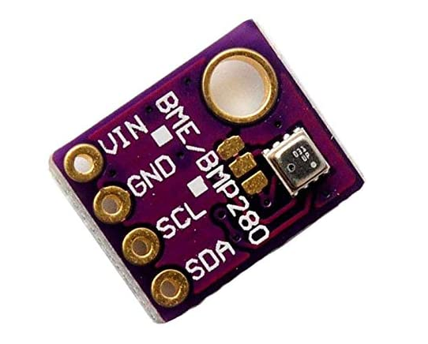

# vscp-python-sensor-bme280



VSCP interface to BME280 barometric sensor

Reports the temperature, pressure, sealevel pressure, humidity and dewpoint for a BME280 sensor and temperature, pressure, sea level pressure for a BMP280 sensor. The appropriate VSCP events are sent to a MQTT broker of choice.

Typically the scripts is used in a [cron job](https://ostechnix.com/a-beginners-guide-to-cron-jobs/.) to deliver the events on timed intervals.

## Install

### Prerequisites

The code here is dependent on the [VSCP helper library](https://github.com/grodansparadis/vscp-helper-lib). Therefore you have to install this package first. It is available for Debian type systems including Raspberry Pi. Check and download the latest version [here](https://github.com/grodansparadis/vscp-helper-lib/releases)

For convenience this is how the current version is installed on a Raaspberry Pi

```bash
wget https://github.com/grodansparadis/vscp-helper-lib/releases/download/v14.0.2/libvscphelper14_14.0.2-1_armhf.deb

wget https://github.com/grodansparadis/vscp-helper-lib/releases/download/v14.0.2/libvscphelper14-dev_14.0.2-1_armhf.deb

sudo dpkg -i ./libvscphelper14_14.0.2-1_armhf.deb
sudo dpkg -i ./libvscphelper14-dev_14.0.2-1_armhf.deb

```

Note that there may be [later versions available)(https://github.com/grodansparadis/vscp-helper-lib/releases) then the one downloaded above. You should **always** install the latest version.

It is recommended to install in a virtual environment in your current project:

```bash
git clone https://github.com/grodansparadis/vscp-python-sensor-bme680.git
cd vscp-python-sensor-bme680
python3 -m venv .env
source .env/bin/activate
```

You may need to install Python venv with 

```bash
apt install python3-venv
```
if it's not installed.

#### Configparser

Configparser can be found on [PyPi](https://pypi.org/) and is documented [https://docs.python.org/3/library/configparser.html](here). Install with

```bash
pip3 install configparser
```
#### Install the smbus module

```bash
pip3 install smbus

```

#### Install VSCP modules

**pyvscphelper** is not needed if only MQTT should be used. You can install the modules from [PyPi](https://pypi.org/)

```bash
pip3 install pyvscp
pip3 install pyvscphelper
```

If you need them on more places either go for a global install or use a virtual environment and install all the modules in it.

#### Install MQTT module

For MQTT functionality Paho MQTT module is needed. You can install the modules from PyPi

```bash
pip3 install paho-mqtt
```

## Configure

You setup the code by either editing the scripts or create a configuration file with the settings. In the scripts all relevant values can be found in the beginning of the file along with documentation.

The settings are named the same in the config file as in the script itself so the documentation for the configuration file is valid also for directly adding the scripts.

To get help you can issue

```bash
mqtt-bme280.py --help
```

on the command line after the module is installed.

The recommended way to configure the scripts is to use a configuration file and store this file in a safe location as it contains usernames and password and in that way can protect this sensitive information. The syntax to instruct the script to read a configuration file is

```bash
mqtt-bme680.py --configure path-to-config-file
```

So 

```bash
mqtt-bme680.py --configure /etc/vscp/bme680-config.ini
```

will read the configuration from _/etc/vscp/bme680-config.ini_


